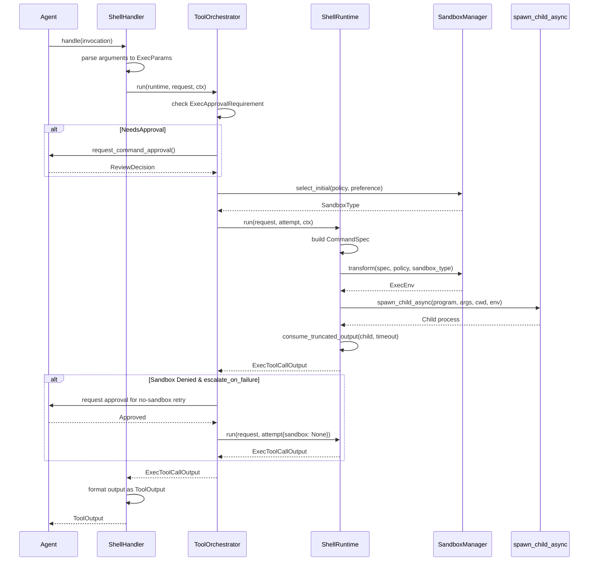
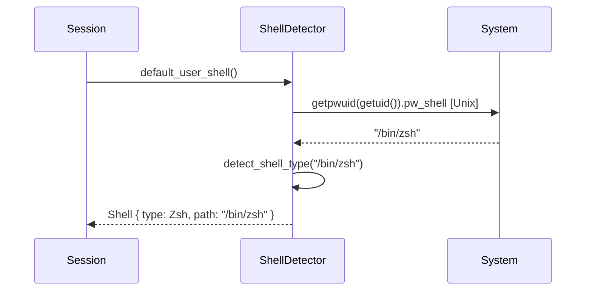

# Executive Summary

This document specifies the **Terminal Spawning Tool** feature—a system that enables an AI agent to execute shell commands on a host machine with comprehensive support for:

- **Multiple spawn modes**: PTY-based interactive sessions or pipe-based non-interactive processes
- **Shell abstraction**: Cross-platform shell detection and command translation (Bash, Zsh, PowerShell, sh, cmd)
- **Sandbox enforcement**: Platform-native sandboxing (macOS Seatbelt, Linux seccomp/Landlock, Windows restricted tokens)
- **Approval workflows**: Configurable human-in-the-loop approval for dangerous operations
- **Process lifecycle management**: Output buffering, timeout handling, cancellation, and cleanup
- **Interactive sessions**: Persistent PTY processes that maintain state across multiple tool calls

The feature is designed for AI coding assistants that need to execute commands while balancing autonomy with safety through layered sandboxing and approval mechanisms.

---

# Glossary

| Term                    | Definition                                                                                           |
| ----------------------- | ---------------------------------------------------------------------------------------------------- |
| **ToolHandler**         | Registry entry that matches incoming tool calls by name and dispatches execution                     |
| **ToolRuntime**         | Execution backend that runs a specific request type under sandbox orchestration                      |
| **ToolOrchestrator**    | Central coordinator managing approval → sandbox selection → execution → retry                        |
| **ExecParams**          | Portable command specification: command vector, working directory, environment, timeout              |
| **ExecEnv**             | Transformed execution environment ready for spawning (includes sandbox wrapper commands)             |
| **SandboxPolicy**       | Session-level filesystem/network access policy (ReadOnly, WorkspaceWrite, DangerFullAccess)          |
| **SandboxPermissions**  | Per-call override (UseDefault, RequireEscalated)                                                     |
| **SandboxType**         | Platform-specific sandbox implementation (None, MacosSeatbelt, LinuxSeccomp, WindowsRestrictedToken) |
| **ProcessHandle**       | Abstraction over a spawned process providing stdin writer, output receiver, and termination          |
| **SpawnedProcess**      | Return value from PTY/pipe spawn containing ProcessHandle, output channel, and exit receiver         |
| **UnifiedExecProcess**  | Managed process wrapper with output buffering, sandbox awareness, and lifecycle hooks                |
| **ApprovalRequirement** | Classification of a command: Skip, NeedsApproval, or Forbidden                                       |
| **Shell**               | Detected user shell with type (Bash/Zsh/PowerShell/sh/cmd), path, and optional environment snapshot  |

---

# Feature Overview & Boundaries

## What the Feature Does

The Terminal Spawning Tool enables an AI agent to:

1. **Execute shell commands** by translating high-level requests into platform-appropriate shell invocations
2. **Manage interactive sessions** where a PTY process persists across multiple tool calls, maintaining shell state
3. **Enforce security policies** through configurable sandboxing and human approval workflows
4. **Stream output** with intelligent truncation and buffering for token-efficient responses
5. **Handle timeouts and cancellation** gracefully, cleaning up process trees

## Boundaries

**In Scope:**

- Shell command execution (one-shot and interactive)
- Cross-platform shell detection and argument translation
- Sandbox policy enforcement with platform-native mechanisms
- Approval caching and retry-without-sandbox flows
- Output buffering with head/tail preservation
- Process group management for clean termination

**Out of Scope:**

- GUI application launching
- Network service management
- Container orchestration
- Remote execution

---

# System Architecture (High Level)

```
┌─────────────────────────────────────────────────────────────────────────────┐
│                            Agent / LLM Interface                             │
├─────────────────────────────────────────────────────────────────────────────┤
│  Tool Invocation Layer                                                       │
│  ┌─────────────────┐  ┌─────────────────┐  ┌─────────────────┐              │
│  │  ShellHandler   │  │ShellCommandHandler│  │ UnifiedExec    │              │
│  │  (shell tool)   │  │ (shell_command)  │  │ (exec_command)  │              │
│  └────────┬────────┘  └────────┬────────┘  └────────┬────────┘              │
│           │                    │                    │                        │
│           └────────────────────┴────────────────────┘                        │
│                                │                                             │
│  ┌─────────────────────────────▼─────────────────────────────────────┐      │
│  │                      ToolOrchestrator                              │      │
│  │  ┌─────────────┐  ┌─────────────┐  ┌─────────────────────────┐    │      │
│  │  │ Approval    │  │ Sandbox     │  │ Retry on Sandbox Denial │    │      │
│  │  │ Workflow    │  │ Selection   │  │ (with re-approval)      │    │      │
│  │  └──────┬──────┘  └──────┬──────┘  └────────────┬────────────┘    │      │
│  └─────────┴────────────────┴──────────────────────┴─────────────────┘      │
│                                │                                             │
│  ┌─────────────────────────────▼─────────────────────────────────────┐      │
│  │                      SandboxManager                                │      │
│  │  ┌──────────────┐  ┌──────────────┐  ┌──────────────┐             │      │
│  │  │ Seatbelt     │  │ Landlock/    │  │ Windows      │             │      │
│  │  │ (macOS)      │  │ seccomp (Linux)│ │ Restricted   │             │      │
│  │  └──────────────┘  └──────────────┘  └──────────────┘             │      │
│  └───────────────────────────────────────────────────────────────────┘      │
│                                │                                             │
├────────────────────────────────▼────────────────────────────────────────────┤
│  Process Spawning Layer                                                      │
│  ┌─────────────────┐  ┌─────────────────┐  ┌─────────────────┐              │
│  │ PTY Spawn       │  │ Pipe Spawn      │  │ spawn_child_async│              │
│  │ (interactive)   │  │ (non-interactive)│  │ (direct)         │              │
│  └─────────────────┘  └─────────────────┘  └─────────────────┘              │
└─────────────────────────────────────────────────────────────────────────────┘
```

---

# Core Data Model & Schemas

## ShellToolCallParams

Parameters for the `shell` tool (command as array):

```typescript
interface ShellToolCallParams {
	command: string[] // e.g., ["ls", "-la"]
	workdir?: string // Working directory (relative to session cwd)
	timeout_ms?: number // Maximum execution time (default: 10000)
	sandbox_permissions?: "use_default" | "require_escalated"
	justification?: string // Reason for escalated permissions
}
```

## ShellCommandToolCallParams

Parameters for the `shell_command` tool (command as freeform string):

```typescript
interface ShellCommandToolCallParams {
	command: string // e.g., "ls -la | grep foo"
	workdir?: string
	login?: boolean // Use login shell semantics (default: true)
	timeout_ms?: number
	sandbox_permissions?: "use_default" | "require_escalated"
	justification?: string
}
```

## ExecParams (Internal)

Portable execution parameters after initial processing:

```typescript
interface ExecParams {
	command: string[] // Full command vector including shell
	cwd: PathBuf // Resolved absolute working directory
	expiration: ExecExpiration // Timeout | DefaultTimeout | Cancellation
	env: Map<string, string> // Environment variables
	sandbox_permissions: SandboxPermissions
	justification?: string
	arg0?: string // Optional argv[0] override
}
```

## ExecEnv (Sandbox-Transformed)

Ready-to-spawn environment after sandbox transformation:

```typescript
interface ExecEnv {
	command: string[] // May include sandbox wrapper (e.g., sandbox-exec)
	cwd: PathBuf
	env: Map<string, string> // Includes CODEX_SANDBOX_* variables
	expiration: ExecExpiration
	sandbox: SandboxType // None | MacosSeatbelt | LinuxSeccomp | WindowsRestrictedToken
	sandbox_permissions: SandboxPermissions
	justification?: string
	arg0?: string
}
```

## Shell

Detected user shell configuration:

```typescript
interface Shell {
	shell_type: "Zsh" | "Bash" | "PowerShell" | "Sh" | "Cmd"
	shell_path: PathBuf // e.g., "/bin/zsh"
	shell_snapshot?: ShellSnapshot // Optional environment snapshot for login shell emulation
}
```

## ProcessHandle

Abstraction over a running process:

```typescript
interface ProcessHandle {
	writer_sender(): Sender<bytes> // stdin channel
	output_receiver(): BroadcastReceiver<bytes> // stdout+stderr
	has_exited(): boolean
	exit_code(): number | null
	terminate(): void
}
```

## SpawnedProcess

Return value from spawn functions:

```typescript
interface SpawnedProcess {
	session: ProcessHandle
	output_rx: BroadcastReceiver<bytes> // Initial output subscription
	exit_rx: OneshotReceiver<number> // Exit code notification
}
```

## ExecToolCallOutput

Result of command execution:

```typescript
interface ExecToolCallOutput {
	exit_code: number
	stdout: StreamOutput<string>
	stderr: StreamOutput<string>
	aggregated_output: StreamOutput<string> // Combined stdout + stderr
	duration: Duration
	timed_out: boolean
}

interface StreamOutput<T> {
	text: T
	truncated_after_lines?: number
}
```

---

# Public Interfaces

## Tool Registration

Tools are registered with a handler that implements:

```typescript
interface ToolHandler {
	kind(): ToolKind // Function | Custom | MCP
	matches_kind(payload: ToolPayload): boolean // Can handle this payload type?
	is_mutating(invocation: ToolInvocation): Promise<boolean> // Affects filesystem?
	handle(invocation: ToolInvocation): Promise<ToolOutput>
}
```

## ToolInvocation

Context passed to handlers:

```typescript
interface ToolInvocation {
	session: Session // Global session state
	turn: TurnContext // Current conversation turn
	tracker: TurnDiffTracker // File change tracking
	call_id: string // Unique identifier for this call
	tool_name: string
	payload: ToolPayload // Function | Custom | LocalShell | MCP
}
```

## ToolPayload Variants

```typescript
type ToolPayload =
	| { type: "Function"; arguments: string } // JSON arguments
	| { type: "Custom"; input: string } // Raw input
	| { type: "LocalShell"; params: ShellToolCallParams }
	| { type: "Mcp"; server: string; tool: string; raw_arguments: string }
```

## ToolOutput

Return value from handlers:

```typescript
type ToolOutput =
	| { type: "Function"; content: string; content_items?: ContentItem[]; success?: boolean }
	| { type: "Mcp"; result: Result<CallToolResult, string> }
```

---

# Runtime Flow (End-to-End)



---

# Initialization, Discovery, and Registration (If Applicable)

## Shell Detection

At session startup, the system detects the user's default shell:



**Detection Algorithm:**

1. On Unix: Read `pw_shell` from `getpwuid(getuid())`
2. Map shell path to type by matching basename (zsh → Zsh, bash → Bash, etc.)
3. Validate shell exists via `which` or fallback paths
4. On Windows: Default to PowerShell, fallback to cmd.exe

## Tool Handler Registration

Handlers are registered in a static registry:

```typescript
// Pseudocode for handler registration
const TOOL_REGISTRY = {
	shell: new ShellHandler(),
	"container.exec": new ShellHandler(), // Alias
	shell_command: new ShellCommandHandler(),
	exec_command: new UnifiedExecHandler(),
	write_stdin: new WriteStdinHandler(),
}
```

---

# Invocation, Routing, and Orchestration

## Invocation Entry Points

### 1. `shell` Tool (Vector Command)

The agent provides a command as an array:

```json
{
	"name": "shell",
	"arguments": "{\"command\": [\"ls\", \"-la\"], \"workdir\": \"src\"}"
}
```

**Flow:**

1. `ShellHandler.handle()` parses `ShellToolCallParams`
2. Converts to `ExecParams` (command vector used as-is)
3. Delegates to `run_exec_like()`

### 2. `shell_command` Tool (Freeform String)

The agent provides a shell command string:

```json
{
	"name": "shell_command",
	"arguments": "{\"command\": \"grep -r 'TODO' src/\"}"
}
```

**Flow:**

1. `ShellCommandHandler.handle()` parses `ShellCommandToolCallParams`
2. Calls `derive_exec_args()` on the session's detected shell
3. For Bash/Zsh: `["/bin/zsh", "-lc", "grep -r 'TODO' src/"]`
4. For PowerShell: `["pwsh", "-Command", "grep -r 'TODO' src/"]`

### 3. `exec_command` Tool (Interactive/Unified Exec)

For interactive sessions that persist:

```json
{
	"name": "exec_command",
	"arguments": "{\"command\": [\"bash\", \"-i\"], \"process_id\": \"1234\", \"yield_time_ms\": 2500}"
}
```

**Flow:**

1. `UnifiedExecHandler` allocates or retrieves process by ID
2. Opens PTY session if new
3. Collects output until yield time or process exit
4. Returns output with optional `process_id` for continuation

### 4. `write_stdin` Tool (Send Input to Existing Process)

```json
{
	"name": "write_stdin",
	"arguments": "{\"process_id\": \"1234\", \"input\": \"export FOO=bar\\n\"}"
}
```

## Orchestration Flow

The `ToolOrchestrator` coordinates the execution:

```
1. APPROVAL PHASE
   ├─ Check ExecApprovalRequirement from exec_policy
   ├─ If Skip: proceed immediately
   ├─ If Forbidden: reject with error
   └─ If NeedsApproval:
       ├─ Check approval cache
       ├─ If cached ApprovedForSession: proceed
       └─ Else: prompt user, cache decision

2. SANDBOX SELECTION PHASE
   ├─ Check sandbox_mode_for_first_attempt(request)
   ├─ If BypassSandboxFirstAttempt: use SandboxType::None
   └─ Else: select_initial(policy, preference)
       ├─ DangerFullAccess → None
       ├─ ExternalSandbox → None
       └─ ReadOnly/WorkspaceWrite → platform sandbox

3. EXECUTION PHASE
   ├─ Transform CommandSpec → ExecEnv via SandboxManager
   ├─ Spawn process with spawn_child_async or PTY
   └─ Collect output with timeout

4. RETRY PHASE (on sandbox denial)
   ├─ Detect denial via is_likely_sandbox_denied()
   ├─ If escalate_on_failure && approval_policy allows:
   │   ├─ Prompt for no-sandbox approval
   │   └─ Re-execute with SandboxType::None
   └─ Else: return error
```

---

# Permissions, Guardrails, and Validation

## Approval Policies

| Policy          | Behavior                                               |
| --------------- | ------------------------------------------------------ |
| `Never`         | Never prompt; agent has full autonomy                  |
| `UnlessTrusted` | Always prompt unless command matches trusted patterns  |
| `OnFailure`     | Prompt only if command fails in sandbox                |
| `OnRequest`     | Prompt for all commands unless DangerFullAccess policy |

## Sandbox Policies

| Policy             | Read                         | Write                | Network      |
| ------------------ | ---------------------------- | -------------------- | ------------ |
| `ReadOnly`         | Anywhere                     | Nowhere              | Blocked      |
| `WorkspaceWrite`   | Anywhere                     | cwd + writable_roots | Configurable |
| `DangerFullAccess` | Anywhere                     | Anywhere             | Full         |
| `ExternalSandbox`  | Delegated to external system |                      |              |

## Safe Command Detection

Commands are classified as "safe" (non-mutating) via `is_known_safe_command()`:

```typescript
// Safe command patterns (no approval needed even in strict modes)
const SAFE_PATTERNS = [
	/^ls\b/,
	/^cat\b/,
	/^head\b/,
	/^tail\b/,
	/^grep\b/,
	/^find\b/,
	/^pwd$/,
	/^echo\b/,
	/^env$/,
	// ... etc
]
```

## Sandbox Denial Detection

After execution, output is scanned for sandbox denial indicators:

```typescript
const SANDBOX_DENIED_KEYWORDS = [
	"operation not permitted",
	"permission denied",
	"read-only file system",
	"seccomp",
	"sandbox",
	"landlock",
	"failed to write file",
]
```

---

# Error Model, Retries, Timeouts, and Cancellation

## Error Types

```typescript
type ExecError =
	| { type: "Timeout"; output: ExecToolCallOutput } // Command exceeded timeout
	| { type: "Denied"; output: ExecToolCallOutput } // Sandbox blocked operation
	| { type: "Signal"; signal: number } // Killed by signal
	| { type: "IoError"; message: string } // Spawn/read failure
	| { type: "Rejected"; reason: string } // User denied approval
```

## Timeout Handling

```typescript
const DEFAULT_EXEC_COMMAND_TIMEOUT_MS = 10_000;
const EXEC_TIMEOUT_EXIT_CODE = 124;  // Conventional timeout exit code

async function consume_truncated_output(child, expiration) {
  select! {
    status = child.wait() => (status, timed_out: false),
    _ = expiration.wait() => {
      kill_child_process_group(child);
      child.start_kill();
      (EXIT_CODE_SIGNAL_BASE + TIMEOUT_CODE, timed_out: true)
    },
    _ = ctrl_c() => {
      kill_child_process_group(child);
      child.start_kill();
      (EXIT_CODE_SIGNAL_BASE + SIGKILL_CODE, timed_out: false)
    }
  }
}
```

## Cancellation

Commands support cancellation via `CancellationToken`:

```typescript
interface ExecExpiration {
	type: "Timeout" | "DefaultTimeout" | "Cancellation"
	duration?: Duration // For Timeout
	token?: CancellationToken // For Cancellation
}
```

## Retry Logic

On sandbox denial (detected via exit code + keywords):

1. Check `escalate_on_failure()` on runtime → true for shell
2. Check approval policy allows retry → not Never/OnRequest
3. Prompt user with denial reason
4. If approved, re-execute with `SandboxType::None`

---

# Async, Streaming, and Concurrency

## Output Streaming

Output is streamed via events during execution:

```typescript
interface ExecCommandOutputDeltaEvent {
	call_id: string
	stream: "Stdout" | "Stderr"
	chunk: bytes
}
```

Streaming is capped to prevent event flooding:

```typescript
const MAX_EXEC_OUTPUT_DELTAS_PER_CALL = 10_000
```

## Output Buffering

For interactive sessions, a `HeadTailBuffer` preserves both beginning and end of output:

```typescript
const UNIFIED_EXEC_OUTPUT_MAX_BYTES = 1024 * 1024 // 1 MiB

class HeadTailBuffer {
	head: bytes[] // First chunks
	tail: bytes[] // Last chunks
	total_bytes: number

	push_chunk(chunk: bytes) {
		if (total_bytes >= MAX_BYTES) {
			// Evict from middle, keep head + tail
		}
	}

	snapshot_chunks(): bytes[] {
		return [...head, ...tail]
	}
}
```

## Concurrent Process Management

The `UnifiedExecProcessManager` tracks up to 64 concurrent interactive processes:

```typescript
const MAX_UNIFIED_EXEC_PROCESSES = 64
const WARNING_UNIFIED_EXEC_PROCESSES = 60

class ProcessStore {
	processes: Map<string, ProcessEntry>
	reserved_process_ids: Set<string>
}

// Pruning policy when at capacity:
// 1. Prefer exited processes outside "recently used" set (last 8)
// 2. Fallback to LRU process outside protected set
```

## Process Group Management

Child processes are placed in their own process group for clean termination:

```typescript
// In pre_exec (Unix):
function detach_from_tty() {
	setsid() // Start new session
}

function set_parent_death_signal(parent_pid) {
	// Linux only
	prctl(PR_SET_PDEATHSIG, SIGTERM)
	if (getppid() != parent_pid) raise(SIGTERM) // Race check
}

// Termination:
function kill_process_group(pgid) {
	killpg(pgid, SIGKILL)
}
```

---

# Logging, Metrics, and Telemetry

## Event Emission

Tool execution emits lifecycle events:

```typescript
// Begin event
ToolEmitter.shell(command, cwd, source, freeform).begin(ctx)

// End event (on completion)
emitter.finish(ctx, result)
```

## Telemetry Preview

Output is truncated for telemetry:

```typescript
const TELEMETRY_PREVIEW_MAX_BYTES = 2048
const TELEMETRY_PREVIEW_MAX_LINES = 50
const TELEMETRY_PREVIEW_TRUNCATION_NOTICE = "[output truncated]"
```

## Approval Metrics

```typescript
otel.counter("codex.approval.requested", 1, {
	tool: "shell",
	approved: decision.to_opaque_string(),
})
```

## Sandbox Environment Variables

Set on spawned processes for observability:

```typescript
// When network access is restricted:
CODEX_SANDBOX_NETWORK_DISABLED = 1

// When running under platform sandbox:
CODEX_SANDBOX = seatbelt // macOS
```

---

# Configuration

## Session-Level Configuration

```typescript
interface SessionConfig {
	sandbox_policy: SandboxPolicy
	approval_policy: AskForApproval
	shell_environment_policy: ShellEnvironmentPolicy // env vars to inherit
	codex_linux_sandbox_exe?: PathBuf // Path to Landlock sandbox binary
}
```

## Per-Turn Context

```typescript
interface TurnContext {
	cwd: PathBuf
	sandbox_policy: SandboxPolicy
	approval_policy: AskForApproval
	shell_environment_policy: ShellEnvironmentPolicy
	codex_linux_sandbox_exe?: PathBuf
}
```

## Environment Variables for Spawned Processes

Interactive sessions (`exec_command`) inject:

```typescript
const UNIFIED_EXEC_ENV = {
	NO_COLOR: "1",
	TERM: "dumb",
	LANG: "C.UTF-8",
	LC_CTYPE: "C.UTF-8",
	LC_ALL: "C.UTF-8",
	COLORTERM: "",
	PAGER: "cat",
	GIT_PAGER: "cat",
	GH_PAGER: "cat",
	CODEX_CI: "1",
}
```

---

# Extension Points

## Adding a New Shell Type

1. Add variant to `ShellType` enum
2. Implement `derive_exec_args()` for the new shell
3. Add detection in `detect_shell_type()`
4. Add discovery in `get_shell()`

## Adding a New Sandbox Backend

1. Add variant to `SandboxType` enum
2. Implement transformation in `SandboxManager.transform()`
3. Add platform detection in `get_platform_sandbox()`
4. Implement denial detection patterns

## Adding a New Approval Policy

1. Add variant to `AskForApproval` enum
2. Update `default_exec_approval_requirement()`
3. Update `wants_no_sandbox_approval()` logic
4. Create corresponding prompt template

## Custom Tool Runtime

Implement these traits:

```typescript
interface ToolRuntime<Request, Output> {
	// From Sandboxable
	sandbox_preference(): SandboxablePreference
	escalate_on_failure(): boolean

	// From Approvable
	approval_keys(req: Request): ApprovalKey[]
	start_approval_async(req: Request, ctx: ApprovalCtx): Promise<ReviewDecision>

	// Execution
	run(req: Request, attempt: SandboxAttempt, ctx: ToolCtx): Promise<Output>
}
```

---

# Reference Implementation Sketch (Pseudocode)

```
// === TYPES ===

enum SandboxType { None, MacosSeatbelt, LinuxSeccomp, WindowsRestricted }
enum ApprovalPolicy { Never, UnlessTrusted, OnFailure, OnRequest }
enum ReviewDecision { Approved, ApprovedForSession, Denied, Abort }

struct ExecParams {
  command: Vec<String>
  cwd: Path
  timeout: Duration
  env: Map<String, String>
  sandbox_permissions: SandboxPermissions
}

struct ExecEnv {
  command: Vec<String>
  cwd: Path
  env: Map<String, String>
  timeout: Duration
  sandbox: SandboxType
}

struct ExecOutput {
  exit_code: i32
  stdout: String
  stderr: String
  timed_out: bool
}

// === SHELL DETECTION ===

function detect_user_shell() -> Shell:
  path = get_passwd_shell() OR "/bin/sh"
  type = match basename(path):
    "zsh" -> Zsh
    "bash" -> Bash
    "pwsh" | "powershell" -> PowerShell
    "sh" -> Sh
    "cmd" -> Cmd
  return Shell { type, path }

function derive_exec_args(shell: Shell, command: String, login: bool) -> Vec<String>:
  match shell.type:
    Zsh | Bash | Sh:
      flag = login ? "-lc" : "-c"
      return [shell.path, flag, command]
    PowerShell:
      args = [shell.path]
      if !login: args.push("-NoProfile")
      args.push("-Command", command)
      return args
    Cmd:
      return [shell.path, "/c", command]

// === SANDBOX TRANSFORMATION ===

function select_sandbox(policy: SandboxPolicy) -> SandboxType:
  if policy == DangerFullAccess OR policy == ExternalSandbox:
    return None
  return get_platform_sandbox() OR None

function transform_for_sandbox(spec: CommandSpec, sandbox: SandboxType) -> ExecEnv:
  env = spec.env.clone()
  if !policy.has_network_access():
    env["CODEX_SANDBOX_NETWORK_DISABLED"] = "1"

  command = [spec.program] + spec.args

  match sandbox:
    None:
      return ExecEnv { command, cwd: spec.cwd, env, sandbox: None }
    MacosSeatbelt:
      env["CODEX_SANDBOX"] = "seatbelt"
      wrapper = ["/usr/bin/sandbox-exec", "-f", profile_path()] + command
      return ExecEnv { command: wrapper, cwd: spec.cwd, env, sandbox }
    LinuxSeccomp:
      wrapper = [sandbox_exe, "--policy", policy_json()] + command
      return ExecEnv { command: wrapper, cwd: spec.cwd, env, sandbox }

// === APPROVAL WORKFLOW ===

async function check_approval(
  request: Request,
  policy: ApprovalPolicy,
  cache: ApprovalCache
) -> ReviewDecision:

  requirement = compute_approval_requirement(request, policy)

  match requirement:
    Skip:
      return Approved
    Forbidden(reason):
      throw Rejected(reason)
    NeedsApproval:
      key = approval_key(request)
      if cache.get(key) == ApprovedForSession:
        return ApprovedForSession

      decision = await prompt_user(request)
      if decision == ApprovedForSession:
        cache.put(key, decision)
      return decision

// === PROCESS SPAWNING ===

async function spawn_child(env: ExecEnv) -> Child:
  command = Command::new(env.command[0])
  command.args(env.command[1..])
  command.current_dir(env.cwd)
  command.env_clear()
  command.envs(env.env)

  // Unix: detach from TTY, set parent death signal
  command.pre_exec(|| {
    setsid()
    prctl(PR_SET_PDEATHSIG, SIGTERM)  // Linux
  })

  command.stdin(Stdio::null())  // Prevent hanging on stdin
  command.stdout(Stdio::piped())
  command.stderr(Stdio::piped())
  command.kill_on_drop(true)

  return command.spawn()

async function spawn_pty(program: String, args: Vec<String>, env: Map) -> SpawnedProcess:
  pty = native_pty_system().openpty(24, 80)
  child = pty.slave.spawn_command(CommandBuilder::new(program).args(args).env(env))

  // Start reader task for PTY output
  reader_task = spawn(async || {
    loop:
      chunk = pty.master.read()
      if chunk.empty(): break
      output_tx.send(chunk)
  })

  // Start writer task for PTY input
  writer_task = spawn(async || {
    while input = writer_rx.recv():
      pty.master.write(input)
  })

  return SpawnedProcess { handle, output_rx, exit_rx }

// === EXECUTION WITH TIMEOUT ===

async function execute_with_timeout(child: Child, timeout: Duration) -> ExecOutput:
  stdout_task = spawn(read_capped(child.stdout))
  stderr_task = spawn(read_capped(child.stderr))

  select:
    status = child.wait():
      stdout = await stdout_task
      stderr = await stderr_task
      return ExecOutput { exit_code: status.code(), stdout, stderr, timed_out: false }

    _ = sleep(timeout):
      kill_process_group(child.pid())
      child.kill()
      return ExecOutput { exit_code: 124, stdout: "", stderr: "", timed_out: true }

// === SANDBOX DENIAL DETECTION ===

function is_sandbox_denied(sandbox: SandboxType, output: ExecOutput) -> bool:
  if sandbox == None OR output.exit_code == 0:
    return false

  keywords = ["operation not permitted", "permission denied", "read-only file system"]
  text = (output.stdout + output.stderr).lowercase()
  return any(k in text for k in keywords)

// === MAIN ORCHESTRATION ===

async function run_shell_tool(invocation: ToolInvocation) -> ToolOutput:
  params = parse_arguments(invocation.payload)
  exec_params = to_exec_params(params, invocation.turn)

  // 1. Approval
  decision = await check_approval(exec_params, invocation.turn.approval_policy, cache)
  if decision in [Denied, Abort]:
    throw Rejected("user denied")

  // 2. First sandbox attempt
  sandbox = select_sandbox(invocation.turn.sandbox_policy)
  exec_env = transform_for_sandbox(exec_params, sandbox)
  child = await spawn_child(exec_env)
  output = await execute_with_timeout(child, exec_params.timeout)

  // 3. Retry without sandbox if denied
  if is_sandbox_denied(sandbox, output):
    if approval_policy != Never:
      retry_decision = await prompt_user_for_retry(exec_params)
      if retry_decision == Approved:
        exec_env = transform_for_sandbox(exec_params, None)
        child = await spawn_child(exec_env)
        output = await execute_with_timeout(child, exec_params.timeout)

  // 4. Format output
  return ToolOutput::Function {
    content: format_output(output),
    success: output.exit_code == 0
  }
```

---

# Worked Example

## Scenario: Execute `grep` Command with Sandbox

**Agent Request:**

```json
{
	"type": "function_call",
	"name": "shell_command",
	"call_id": "call_abc123",
	"arguments": "{\"command\": \"grep -r 'TODO' src/\", \"timeout_ms\": 5000}"
}
```

**Step 1: Handler Dispatch**

```
ShellCommandHandler.handle(invocation)
  params = ShellCommandToolCallParams {
    command: "grep -r 'TODO' src/",
    timeout_ms: 5000,
    ...defaults
  }
```

**Step 2: Shell Command Translation**

```
session.user_shell() = Shell { type: Zsh, path: "/bin/zsh" }
derive_exec_args(shell, "grep -r 'TODO' src/", login=true)
  → ["/bin/zsh", "-lc", "grep -r 'TODO' src/"]
```

**Step 3: Build ExecParams**

```
ExecParams {
  command: ["/bin/zsh", "-lc", "grep -r 'TODO' src/"],
  cwd: "/home/user/project",
  expiration: Timeout(5000ms),
  env: { PATH: "...", HOME: "...", ... },
  sandbox_permissions: UseDefault
}
```

**Step 4: Orchestrator - Approval Check**

```
approval_policy = OnRequest
sandbox_policy = WorkspaceWrite
is_known_safe_command(["/bin/zsh", "-lc", "grep ..."]) = true  // grep is safe
→ ExecApprovalRequirement::Skip { bypass_sandbox: false }
```

**Step 5: Orchestrator - Sandbox Selection**

```
sandbox_mode_for_first_attempt(request) = NoOverride
select_initial(WorkspaceWrite, Auto) = MacosSeatbelt  // on macOS
```

**Step 6: SandboxManager Transform**

```
ExecEnv {
  command: [
    "/usr/bin/sandbox-exec",
    "-f", "/tmp/codex-sandbox-profile.sb",
    "-D", "CWD=/home/user/project",
    "/bin/zsh", "-lc", "grep -r 'TODO' src/"
  ],
  cwd: "/home/user/project",
  env: { ..., CODEX_SANDBOX: "seatbelt", CODEX_SANDBOX_NETWORK_DISABLED: "1" },
  sandbox: MacosSeatbelt
}
```

**Step 7: Process Spawn**

```
child = spawn_child_async(
  program: "/usr/bin/sandbox-exec",
  args: ["-f", "...", "/bin/zsh", "-lc", "grep ..."],
  cwd: "/home/user/project",
  env: { ... },
  stdio_policy: RedirectForShellTool  // stdin=null, stdout/stderr=piped
)
```

**Step 8: Output Collection**

```
consume_truncated_output(child, Timeout(5000ms))
  → stdout: "src/main.rs:42:    // TODO: refactor this\n"
  → stderr: ""
  → exit_code: 0
  → timed_out: false
```

**Step 9: Result Formatting**

```
ExecToolCallOutput {
  exit_code: 0,
  stdout: StreamOutput { text: "src/main.rs:42:    // TODO: refactor this\n" },
  stderr: StreamOutput { text: "" },
  aggregated_output: StreamOutput { text: "src/main.rs:42:    // TODO: refactor this\n" },
  duration: 127ms,
  timed_out: false
}
```

**Step 10: Tool Output**

```json
{
	"type": "function_call_output",
	"call_id": "call_abc123",
	"output": "src/main.rs:42:    // TODO: refactor this\n"
}
```

## Scenario: Interactive Session

**Request 1: Start bash session**

```json
{
	"name": "exec_command",
	"arguments": "{\"command\": [\"bash\", \"-i\"], \"process_id\": \"1001\", \"yield_time_ms\": 2500, \"tty\": true}"
}
```

**Processing:**

1. PTY spawned with bash
2. Output collected for 2500ms
3. Process persisted with ID "1001"
4. Response includes `process_id: "1001"` indicating session is alive

**Request 2: Send command to session**

```json
{
	"name": "write_stdin",
	"arguments": "{\"process_id\": \"1001\", \"input\": \"export FOO=bar\\n\", \"yield_time_ms\": 1000}"
}
```

**Processing:**

1. Retrieve process "1001" from store
2. Write `export FOO=bar\n` to PTY stdin
3. Wait 100ms for process to react
4. Collect output for remaining yield time
5. Response includes any shell prompt/echo

**Request 3: Verify variable**

```json
{
	"name": "write_stdin",
	"arguments": "{\"process_id\": \"1001\", \"input\": \"echo $FOO\\n\", \"yield_time_ms\": 1000}"
}
```

**Response:**

```json
{
	"output": "bar\n",
	"process_id": "1001",
	"exit_code": null
}
```

The session maintains state across calls, proving environment variable persistence.
